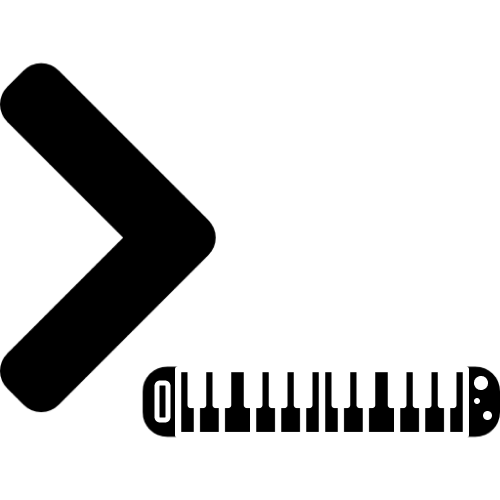

# Musical Sorts

## Description
Programs using audio to help visualize the different sorting algorithms.

### Bubble Sort

### Insertion Sort

### Merge Sort

### Quick Sort

### Heap Sort

### Counting Sort

### Radix Sort

### Bucket Sort

